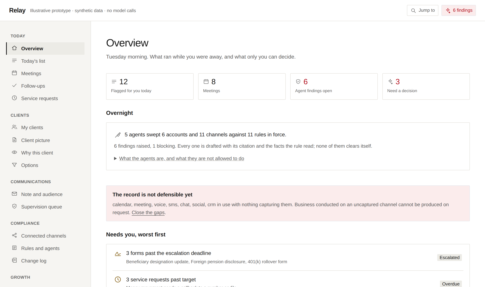

<p align="center">
  <a href="https://nikjain15.github.io/relay/"></a>
</p>

<h1 align="center">Relay</h1>

<p align="center"><b>An agent layer for financial advisors. Relay reads the book, drafts and prepares; a person decides and sends.</b></p>

<p align="center">
  <a href="https://github.com/nikjain15/relay/actions/workflows/ci.yml"></a>
  
  
  
  <a href="LICENSE"></a>
  
</p>

<p align="center">
  <a href="https://nikjain15.github.io/relay/"><b>Live at nikjain15.github.io/relay ↗</b></a> &nbsp;·&nbsp; walkthrough at <a href="https://nikjain15.github.io/relay/walkthrough/"><code>/walkthrough/</code></a>
</p>

---

**A working prototype of the step after an insight engine.** A wealth manager's AI can flag twenty
million client opportunities a year; what it cannot do is turn one into a documented, approved,
client-facing action. Relay is that path, and the agent layer around it: eight agents that read the
advisor's whole book on a cadence, cite every claim, prepare every action short of the human gate,
and hand each decision to a person.

**Every client, advisor, document and message here is invented.** Instruments, tax mechanics and
regulatory constraints are real, so the engines are genuinely exercised. Provenance for every
composite is in [`docs/PERSONAS.md`](docs/PERSONAS.md).

## What the agents do

| Agent | Reads | Leaves for a person |
|---|---|---|
| **Communications surveillance** | Every draft and every captured message, both directions | Holds, review queue entries, a drafted correction |
| **Record completeness** | What the advisor attests to using against what is captured | The sources to connect, each gap with its regulation named |
| **Recommendation evidence** | Each proposal as it is released | A hold until the care-obligation record is complete |
| **Client protection** | Every account: specified adults, concentration at a point and over 90 days | Holds, callbacks on the number on file, forms to request, a client note |
| **Conduct** | The captured corpus, for outside business activity | A disclosure form to request |
| **Research** | The client file, the service queue, the firm's record, the channels, the corpus | A briefing: what changed, what is observed, what is inferred, what could not be established |
| **Retrieval** | The document corpus, on every opportunity | Cited passages with a reason per score, or a refusal that names what is missing |
| **Rule-change proposer** | Ninety days of findings | Tighten-only rule changes, with the findings behind each |

Every one of them detects, assembles, drafts and prepares on its own. None of them sends, schedules,
writes to a system of record, clears a finding, or loosens a rule.

## Three invariants, enforced rather than described

| Invariant | Enforced by |
|---|---|
| **Relay never sends.** No module in `app/`, `components/` or `lib/` can reach an outbound transport | `.dependency-cruiser.cjs`, `tests/invariants/no-outbound-path.test.ts`, a `connect-src 'self'` policy at runtime |
| **The model never decides.** Eligibility, ranking, the recipient count, the supervisory regime, every rule verdict, the retrieval floor and the refusal are deterministic code | `deterministic-no-model` and its transitive twin |
| **Nothing clears its own findings.** An agent detects and prepares; a principal dispositions; a person accepts each prepared action | `requiresHuman` in `lib/compliance/engine.ts`; no autonomous disposition or acceptance path exists |

Every guard was **seen failing on a deliberate violation** before being recorded as enforced. That
rule is in [`AGENTS.md`](AGENTS.md).

## Everything is data

| Add | By |
|---|---|
| A client, with holdings, goals, rules, history, notes, paperwork, the firm's supervisory record, the custodian's valuation history and every captured message | One file in `data/clients/` |
| An advisor, with their connected sources, attestations, prospects, settings profile and calendar | One file in `data/advisors/` |
| A document, with its desk, review cycle, status, supersession chain and structured claims | One file in `data/documents/` |
| A compliance rule, with its citation, condition, parameters, evidence keys and the actions its agent prepares | One entry in `data/compliance/rules.json` |
| An agent | One entry in `data/compliance/agents.json` |

Then `npm run data:build`. `validate()` fails the build on anything inconsistent: holdings that do not
sum, a Liquidity figure that disagrees with the holdings, a citation to a document that does not exist,
a one-sided supersession chain, a stored valuation for today, a message on an unknown connector. See
[`data/README.md`](data/README.md).

## Stack

- **Next.js 15 (App Router)**, TypeScript strict, Tailwind with every colour as a design token
- **No runtime dependencies beyond React and Next.** No model client, no network client, nothing to send with
- **Vitest** for unit and invariant tests, **dependency-cruiser** for the architecture rules, **Playwright** driving Chromium for the browser suite
- **Static export** to GitHub Pages; the whole app runs from `data/`, with no server and no database

## Repository layout

| Dir | Role |
|---|---|
| `app/` | Next.js routes, one folder per surface |
| `components/` | React UI: the shell, the drawn icon set, the chart forms, one view per console |
| `lib/compliance/` | Rule DSL, tighten-only policy resolution, the engine, agents, the sweep, prepared actions, the proposer, replay, the change log |
| `lib/evidence/` | Corpus state, lexical search with a reason per score, retrieval and the refusal |
| `lib/research/` | The research agent's probes and the briefing they assemble |
| `lib/connectors/` | Read-only connector catalog and the coverage model |
| `lib/constraints/`, `lib/ranking/`, `lib/recipients/`, `lib/policy/` | The deterministic engines behind proposals, today's list, the audience count and the draft checks |
| `lib/profile/`, `lib/learning/` | Four-layer personalization and the learning loop that proposes and never decides |
| `data/` | Every record, one file each, plus firm policy, the rule set and the generated bundle |
| `tests/` | Unit tests and the invariant suite |
| `scripts/` | The data bundler, the walkthrough builder, the browser suite and the stress run |
| `docs/` | Architecture, build spec, design system, personas, the walkthrough mockup |

## Run it

```bash
npm ci
npm run check                    # typecheck, lint, import invariants, data check, 254 tests
npm run dev                      # http://localhost:3000
npx next build && npm run e2e    # 52 browser checks at 1440, 1280, 1024, 768 and 390
npm run stress                   # 1,000 clients, 50 advisors, 2,000 messages, 20,000 events, in memory
```

Checks run **sequentially**, never in parallel. CI runs the check and the browser suite on every pull
request; the Pages deploy runs on `main` behind a green check.

## Documents

| File | What |
|---|---|
| [`docs/ARCHITECTURE-compliance.md`](docs/ARCHITECTURE-compliance.md) | Connectors, the rule set, the agents, prepared actions, the proposer, replay and the change log |
| [`docs/ARCHITECTURE-research-and-retrieval.md`](docs/ARCHITECTURE-research-and-retrieval.md) | Retrieval with a reason per score, conflicts, staleness, the refusal; the research agent's probes and citations |
| [`docs/ARCHITECTURE-personalization.md`](docs/ARCHITECTURE-personalization.md) | The four layers, the single read path, and the learning loop |
| [`docs/BUILD-SPEC.md`](docs/BUILD-SPEC.md) | Surfaces, data model, engine responsibilities, demo path, tests |
| [`docs/DESIGN-SYSTEM.md`](docs/DESIGN-SYSTEM.md) | Principles, tokens, components, icons, charts, and what agent-first means as a rule |
| [`docs/PERSONAS.md`](docs/PERSONAS.md) | Every composite, with the kind and public source of each detail |
| [`data/README.md`](data/README.md) | Every data file, what it holds, and what `validate()` checks |

## Licence and scope

Source-available for viewing and evaluation ([`LICENSE`](LICENSE)). A prototype built to explore a
product thesis. Synthetic data only, `noindex` on every page, and no affiliation with or endorsement by
any firm named in its public-source citations.
