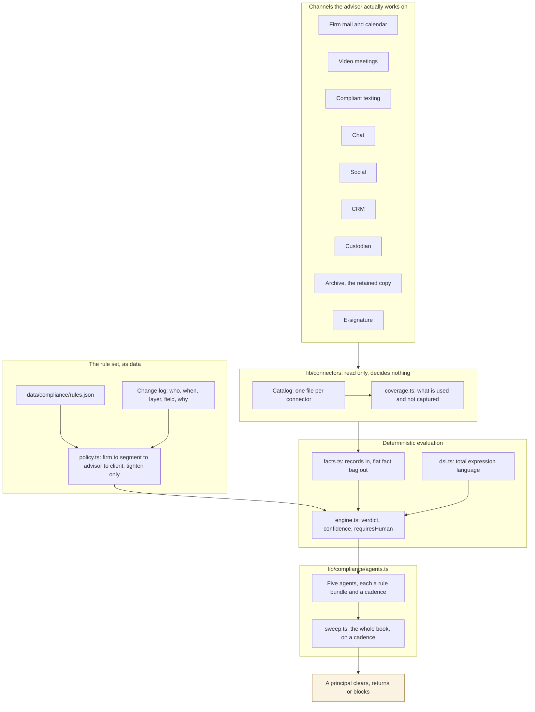

# Relay: connectors, compliance agents and a configurable rule set

**Version:** v1.0, 2026-09-26. Built in the prototype; the production mapping in §8 is design.

**In one line:** connectors read the channels an advisor actually uses and decide nothing; the rule set
is data a supervisor edits at runtime, resolved firm to segment to advisor to client and only ever
tightened; agents run that rule set across the book on a cadence, draft the finding with its citation
and evidence, and hand every decision to a person.

**The three claims worth testing, and where to look:**

| Claim | Where it is true, not just stated |
|---|---|
| A change to a rule is live with no release | `lib/compliance/store.ts`; `tests/unit/compliance.test.ts` proves identical facts change verdict when a threshold moves |
| Nobody can loosen a rule from a lower layer | `lib/compliance/policy.ts`; refusals are recorded in `rejected`, never dropped |
| The system never clears its own findings | `lib/compliance/engine.ts` sets `requiresHuman`; `components/supervision-view.tsx` has no autonomous disposition path |

---

## 1. The shape of the thing



Two things are deliberately absent from that diagram. There is no arrow out of Relay to a client:
nothing in `app/`, `components/` or `lib/` can import an outbound transport, and dependency-cruiser
fails the build if anything tries. And there is no arrow from `agents` back to a cleared state: a
finding leaves the system only through a person.

## 2. Connectors: the question they answer

The expensive failure in this industry is not a bad recommendation. It is a conversation nobody can
produce. So `coverageFor()` does not report what is connected. It compares what the advisor has
**attested to using** against what is actually captured, and resolves each channel to one of four
states with the exposure named:

| State | Meaning |
|---|---|
| `covered` | In use and captured by a system of record |
| `partial` | Captured, but no connected source is the retained copy. Evidence exists and retention does not |
| `gap` | In use and nothing is capturing it. Business conducted off the record |
| `unused` | Not used and not connected. Nothing to capture |

A **degraded** connector counts as uncaptured, not covered. The demo data makes this concrete on
purpose: Advisor A has ten sources and looks healthy, and is not defensible, because texting has been
failing for two days and three channels they attested to using have no source at all.

**Read-only by construction, not by convention.** The `ReadCapability` union has no send verb, so
there is no name for an outbound operation to call. Two dependency-cruiser rules make it structural:
`connectors-are-read-only` forbids any outbound transport import, and `connectors-decide-nothing`
forbids importing `lib/compliance` or a model client. Both were seen failing on a planted violation
before being recorded as enforced.

**Adding a channel is one file and two lines.** A connector definition declares its channel, its read
capabilities, the record classes it produces, its retention role, and why a compliance officer cares.
Nothing else in the system needs to change, which is the test of whether an extension point is real.

It deliberately does **not** declare which rules depend on it. An earlier version did, and the two
copies of that one relationship drifted: two connectors named rule ids that no longer existed, and the
archive omitted a rule that requires it. A rule already names the connectors it requires, because that
is what the engine reads when deciding whether it can evaluate the rule at all, so the other direction
is derived in `lib/compliance/sources.ts` and the catalog holds no claim about rules. The dead links
were found by the browser suite checking that every fragment link has a target that exists.

## 3. The rule set is data

A rule carries its authority and citation, a scope, a severity, whether the firm made it mandatory, a
condition tree, its editable parameters, the facts it reads, a drafted finding and remediation, a
confidence floor, and the connectors it requires.

The condition is JSON, not a compiled predicate:

```json
{ "all": [
  { "fact": "recipientCount30d", "cmp": "gt", "param": "threshold" },
  { "not": { "fact": "principalApproved", "cmp": "eq", "value": true } }
] }
```

Three consequences, and they are the reason for the design:

1. **The console can render and edit it.** The common change is a number in a form, because thresholds
   are read from named parameters rather than written into the expression.
2. **Evaluation is total.** An unknown fact is false, never an exception, so a malformed rule cannot
   crash a supervisory sweep.
3. **A change needs no release.** The effective policy is the baseline with the change log folded onto
   it, so the next evaluation uses the new value. Twelve rules ship as the baseline: FINRA 2210, 3110,
   2111, 2165, 4513 and 3270; SEC Reg BI, 17a-4, 206(4)-1 and Reg S-P; and FINRA RN 24-09 on
   supervising machine-drafted communications.

### 3.1 Personalization, and why it can only tighten

The same four layers as the settings resolver, and the same direction of travel for anything that is a
rule rather than a preference:

```
firm ─▶ segment ─▶ advisor ─▶ client
```

A lower layer may enable a rule the firm left off, raise a severity, and move a threshold in the
stricter direction. It may not disable a mandatory rule, lower a severity, or loosen a threshold.
Without that, "configurable" means "an advisor can switch off the rule that would have caught them".

Every refused change is recorded in `rejected` rather than dropped, because a layer that tried to
loosen a rule is itself a supervision signal. The seeded log carries one: an advisor whose book is
concentrated by design asking for a higher concentration ceiling. It is refused, the reason is on
screen, and the request stands as a conversation a supervisor should have rather than a setting nobody
sees.

This is also what makes the rule set groundable in one advisor's actual workflow. A pooled remote team
that sends the same language to many households tightens the 2210 review threshold from 25 to 15, to
stay clear of the line rather than sitting on it. An advisor serving pre-liquidity founders raises the
severity on concentration rather than the ceiling. Neither needs a code change, and neither can produce
a weaker rule than the firm's.

## 4. The change log is the state

The console never mutates a rule. It appends an entry: actor, timestamp, layer, target, field, old
value, new value, and a reason that is required before the change is recorded.

Three properties follow, and each answers a question a supervisor is actually asked:

- **"Who changed this, and why?"** It is on the entry, not in someone's memory.
- **"What were the rules when you cleared that?"** Replay the log to that timestamp. The rule set is
  reconstructed, not recalled.
- **"Did anyone try to weaken this?"** The attempt is in the log whether or not it was applied.

In the prototype the log lives in session state and an undo removes the entry. In production a
reversal is itself an entry, so the log stays append-only and a reversal is as attributable as the
change it reverses. The doc says this rather than letting a demo imply otherwise.

## 5. Agents: autonomous detection, human disposition

An agent is not a second engine. It is a bundle of rules, a scope, a cadence and an owner, so a
supervisor can reason about "who is watching communications" instead of about twelve loose rules.

| Agent | Watches | Cadence |
|---|---|---|
| Communications surveillance | 2210 regime, 3110 review, 206(4)-1 marketing, RN 24-09, Reg S-P | On every draft |
| Record completeness | Off-channel gaps, 17a-4 retention | Daily |
| Recommendation evidence | Reg BI care obligation | On every proposal |
| Client protection | 2165 specified adults, 4513 complaints, 2111 suitability | Daily |
| Conduct | 3270 outside business activities | Weekly |

**What is autonomous:** detection, classification, evidence assembly, the drafted finding, the drafted
remediation, the citation, and the ranking of the queue.

**What is not:** the disposition. Anything that fires reaches a principal. So does anything whose
confidence sits below the rule's floor, which is how an inference gets confirmed by a person instead of
quietly clearing itself. So does anything a rule could not evaluate because its source is absent, which
is reported as `cannot_evaluate` and never as a clear.

Two guards keep the configurable layer honest. A rule whose connector is missing names the missing
source rather than passing. And a mandatory rule in force that no enabled agent watches raises a
warning the console cannot dismiss, so switching an agent off cannot quietly retire a firm obligation.

### 5.1 The sweep is the point

A check that runs when an advisor submits a draft catches what the advisor brought you. The sweep
catches the account nobody opened this week. In the prototype it finds, without anyone asking, a
79-year-old whose beneficiary was changed to a younger family member by phone, on an account with no
trusted contact on file: FINRA 2165 with the indicator named and the evidence attached.

One defect found by reading the sweep's own output is worth recording, because it is the failure mode of
this whole category. A rule's confidence was the minimum across the entire fact bag, so an inference
belonging to a different rule dragged unrelated verdicts under their floor. Four clean accounts were
being sent to a principal with a finding that named no fact the rule used. A rule is now judged only on
its own evidence keys. A queue full of findings a supervisor cannot act on is how a surveillance system
gets ignored, and that is a product failure, not a tuning problem.

## 6. Where the model is, and where it is not

| Step | Deterministic code | Model |
|---|---|---|
| Extract a fact from free text, such as whether a message reads as a grievance | | Yes, with a confidence below one |
| Transcribe and summarise a meeting | | Yes |
| Compose the language of a finding or a remediation | Templates today | Yes in production |
| Evaluate a rule against the facts | Yes | Never |
| Resolve which rules are in force, at what strength | Yes | Never |
| Decide the supervisory regime | Yes | Never |
| Decide whether a human is needed | Yes | Never |

A typed-value model such as Jev, which returns a value and a confidence rather than prose, fits the
extraction column well, and the boundary above is what makes that safe: a verdict never depends on a
model's prose, and prompt injection in a client email can at worst move an inferred fact, which lands
below its confidence floor and in front of a person.

## 7. What the invariants are, and how they are enforced

| Invariant | Enforced by | Seen failing on a planted violation |
|---|---|---|
| No module can reach an outbound transport | dependency-cruiser `no-outbound-transport`, `tests/invariants/no-outbound-path` | Yes |
| Connectors import no transport | `connectors-are-read-only` | Yes |
| Connectors reach no verdict logic | `connectors-decide-nothing` | Yes |
| Deterministic modules import no model client, by any path | `deterministic-no-model`, `deterministic-no-model-transitive` | Yes |
| Personalization cannot widen what is allowed | `personalization-cannot-widen` and its transitive twin, `tests/invariants/personalization-cannot-widen` | Yes |
| No client data or id literal in code | `tests/invariants/no-client-data-in-code` | Yes, it caught a hard-coded advisor id during this build |
| Every table scrolls itself, not the page | `tests/invariants/responsive` | Yes |

## 8. Production mapping

| Prototype | Production |
|---|---|
| `data/connectors.json` connection state | A connection service per tenant, with OAuth held outside the app and a health check per source |
| Ingestion implied by the catalog | An ingestion pipeline writing to the firm's 17a-4 store, WORM or the audit-trail alternative permitted since October 2022 |
| `data/compliance/rules.json` | A rule service, versioned, with the same JSON contract; the console writes through it |
| Change log in session state | An append-only table, one row per change, with a reversal as its own row |
| `sweep()` called on render | A scheduled job per cadence, writing cases to a supervisory work queue |
| Case dispositions in session state | The firm's supervisory system of record, with the facts the rule read attached to each disposition |
| Inferred facts from regular expressions | A typed extraction model with per-fact confidence, evaluated against a labelled set before it is trusted |

## 9. What this does not do

- It does not dispose of a finding. Ever.
- It does not send, post or submit anything. A person does.
- It does not decide a supervisory regime with a model.
- It does not report a rule as clear when it could not evaluate it.
- It does not let a lower layer produce a weaker rule than the layer above.
- It does not claim a guard is enforced until that guard has been seen failing on a deliberate
  violation.
