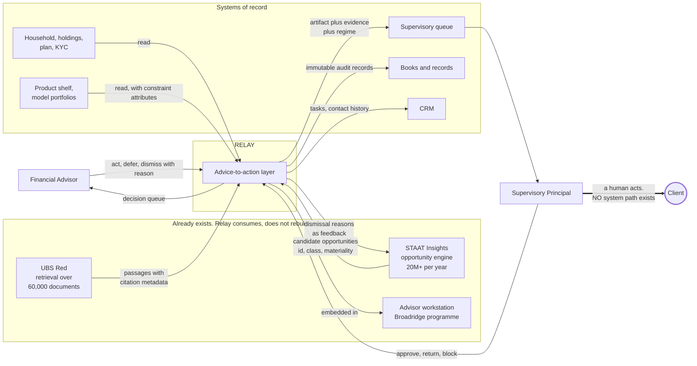
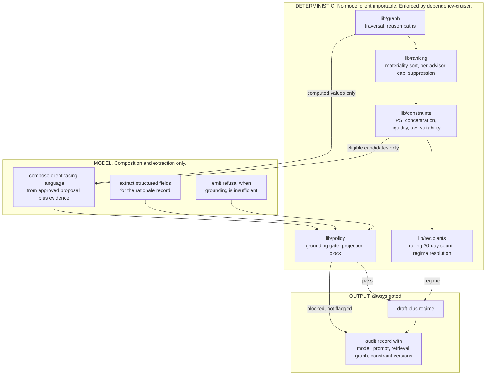
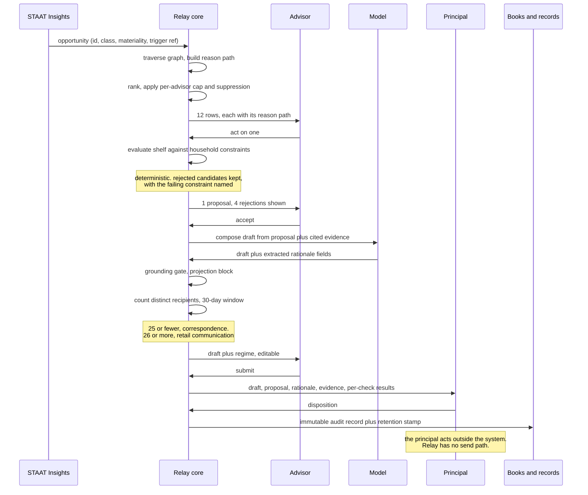
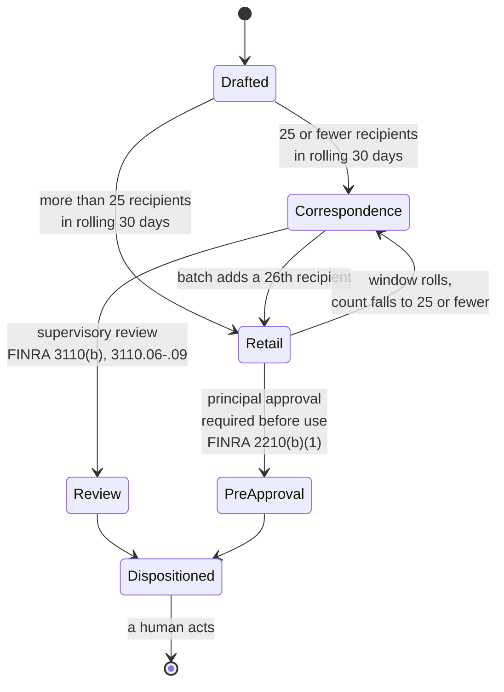
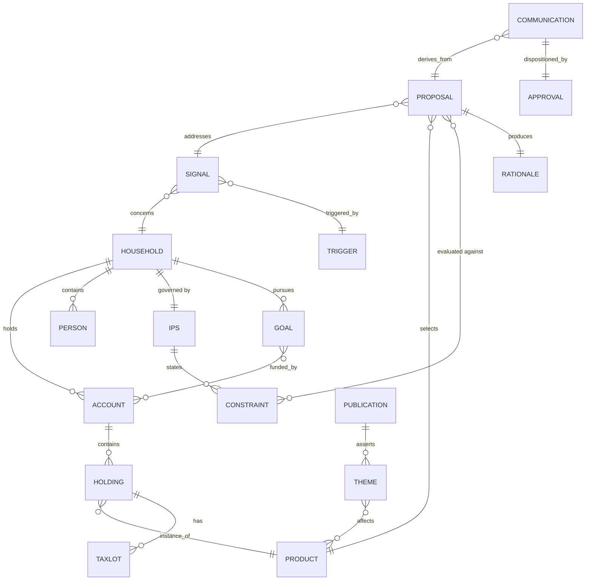

# Relay: architecture

**Version:** 1.0, 2026-09-26
**Companion to:** `PRD-relay.md` v1.0 (§5 requirements) and `BUILD-SPEC.md` v1.0 (implementation)
**Status:** design, for discussion

**Diagrams render inline below on GitHub.** Standalone SVGs for full-screen display are in
`docs/diagrams/`, generated from the same Mermaid sources in this file, so the two cannot drift:
`01-system-context.svg`, `02-determinism-boundary.svg`, `03-critical-path.svg`,
`04-regime-state-machine.svg`, `05-data-model.svg`.

Three architectural claims carry this design. Everything else follows from them.

1. **Relay consumes the existing signal and retrieval layers and rebuilds neither.** It is a consumer,
   not a competitor, of the opportunity engine.
2. **The model composes language. It never decides eligibility.** Eligibility, ranking, recipient
   counting and policy checks are deterministic code. This is what makes the system reviewable by a
   supervisory principal, which is the difference between a demo and something that ships in wealth.
3. **No path exists from the system to a client.** Not a policy, a property of the dependency graph,
   enforced in CI.

---

## 1. System context

*Full-screen: [`docs/diagrams/01-system-context.svg`](diagrams/01-system-context.svg)*

What Relay owns, what it consumes, and what it deliberately does not build.



**Read the last edge carefully.** It starts at a person, not at Relay. There is no arrow from `CORE` to
`Client` anywhere in this diagram, and there is none in the dependency graph either. That absence is the
architecture.

**What Relay does not build, and says so out loud:** opportunity generation (STAAT Insights exists and
won Celent 2026), document retrieval and general advisor chat (UBS Red exists), the workstation shell
(Broadridge programme in flight), portfolio construction, and any client-facing surface.

---

## 2. The determinism boundary

*Full-screen: [`docs/diagrams/02-determinism-boundary.svg`](diagrams/02-determinism-boundary.svg)*

The most important line in the system. Everything left of it is inspectable, replayable code.
Everything right of it is a language model, and it is confined to composition and extraction.



**Why this shape.** A supervisor can be asked to trust a rule; they cannot be asked to trust a
generation. So eligibility is a rule, and the model is only allowed to say in English what the rules
already decided. Two consequences worth stating in an interview:

- **Unattributable output is blocked, not flagged.** A warning is a thing people click past.
- **The proposal engine's output space is finite**: the approved shelf crossed with the action verbs,
  filtered by constraints. The model ranks and explains inside that set. It cannot invent a product.

The forbidden edges are machine-checked:

```
lib/constraints, lib/ranking, lib/recipients  ──✗──▶  any model client
lib, components, app                          ──✗──▶  any outbound transport
```

---

## 3. The critical path

*Full-screen: [`docs/diagrams/03-critical-path.svg`](diagrams/03-critical-path.svg)*

One opportunity, from arrival to a client action. The path the demo walks.



**The measured funnel is this sequence.** Generated, surfaced, opened, decided, proposal generated,
proposal accepted, drafted, submitted, dispositioned, client contacted. Conversion, not volume, is what
gets reported.

---

## 4. Regime resolution

*Full-screen: [`docs/diagrams/04-regime-state-machine.svg`](diagrams/04-regime-state-machine.svg)*

The control that shapes the product, as a state machine. Recipient count is the only input.



**Three consequences, and the second one is the design insight.**

1. A personalised note to one household is **correspondence**, not a retail communication. The common
   claim that an AI-drafted client note is automatically a retail communication is wrong.
2. **Batch handling is where the regime flips.** Adding the 26th recipient converts the same text into a
   retail communication. So the counter is a first-class product surface that the advisor sees *before*
   they send, and batch is gated on it. A feature that silently crossed that line would create an
   unapproved retail communication at scale.
3. **Personalisation is a compliance asset**, not only a quality one. A genuinely per-household note
   stays in the lighter regime; a near-identical template dressed as personalisation does not.

**Forward-looking, and stated as a question rather than a plan.** FINRA Regulatory Notice 26-14 (9 July
2026, comments closed 11 September 2026) proposes replacing blanket principal pre-use approval with a
risk-based framework in which a firm's own written procedures decide what needs pre-approval, and it
addresses AI-generated communications directly. **It is a proposal and may change or fail.** If adopted,
the binding question becomes "can the firm evidence each communication's risk tier?", which is exactly
what this state machine plus the audit record already produce.

---

## 5. Data model

*Full-screen: [`docs/diagrams/05-data-model.svg`](diagrams/05-data-model.svg)*

The graph is real. Reason codes come from traversal, so the explanation shown to the advisor is the same
object the system decided with, not a narration written afterwards.



**Reason path as a typed object, not a string.** A path is an ordered array of nodes, each carrying what
it contributed, so the renderer displays the decision rather than describing it:

```
ExternalEvent(property sale, $4.1M)
  → Household(Renner)
    → Goal(liquidity, funded 0 of 36 months)
    → Holding(single name, 71% of investable)
      → Constraint(concentration max 25%, breached)
```

Every advisor-visible artifact carries a **reconstruction header**: model version, prompt version,
retrieval snapshot id, graph version, constraint set version, timestamp. Any past decision can be
rebuilt without replaying a model, which is what makes the audit trail worth having.

---

## 6. Trust boundaries and data flow

| Boundary | What crosses | What never crosses |
|---|---|---|
| STAAT Insights to Relay | Opportunity ids, class, materiality, trigger references | Nothing written back except dismissal reasons as labelled feedback |
| Retrieval to Relay | Passages with citation metadata | No client data leaves the perimeter to obtain them |
| Relay to model | Approved proposals, computed values, cited passages | Raw client identifiers; eligibility decisions |
| Relay to supervisory queue | Draft, proposal, rationale, evidence, per-check results, regime | Nothing that bypasses the queue |
| Relay to client | **Nothing. There is no boundary here.** | Everything |

Client data stays inside the existing perimeter. Prompts, retrieved context and generated drafts that
inform a recommendation or a client communication are **retained as records**, not treated as ephemeral
application logs.

---

## 7. Failure modes and degradation

| If this fails | Behaviour | Why |
|---|---|---|
| Proposal engine unavailable | Opportunities and evidence still render; proposals unavailable and labelled | Triage has standalone value; it is V0 |
| Retrieval unavailable | Signals render with reason paths; explanation refuses and says why | A refusal is correct behaviour, not an error state |
| Model unavailable | Everything except drafting works | Drafting is the only model-dependent surface |
| Graph version mismatch | Artifact refuses to render rather than showing a stale reason path | A wrong explanation is worse than none |
| Recipient count unavailable | Drafting blocked | Unknown regime is never assumed to be the lighter one |

That last row is the one to defend in a compliance conversation: **when the regime cannot be determined,
the product stops.** It does not guess, and it does not default to the cheaper path.

---

## 8. What I would want to change after week one

Stated because a design with no open questions is a design nobody has pressure-tested.

- **Materiality is upstream and I do not control it.** If it is calibrated against content salience
  rather than advisor action, ranking inherits that and the cap makes it worse. First thing to measure.
- **The graph may be redundant.** If the upstream engine already emits a usable causal chain, Relay
  should render theirs rather than rebuild traversal. Cheaper, and a better partnership.
- **Correspondence versus retail may already be solved somewhere in the firm.** If a supervisory system
  already counts recipients, Relay should call it rather than own it.
- **The eval harness is the piece most likely to outlive the product.** It may be worth building as a
  shared service from the start rather than inside Relay.
